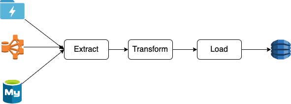

# 什么是ETL

ETL是以下三个词的简称:
```
E - Extract: 数据的抽取, 读取
T - Transform: 数据的转化, 处理
L - Load: 数据加载到目的存储
```

所以说ETL是一个过程, 这个过程就是数据工程的标准过程



通常情况下在数据从数据湖(可能是文件系统, 数据库等等)提取出来, 经过一系列转化, 最后写入数据仓库(可能是文件系统, 数据库等等).