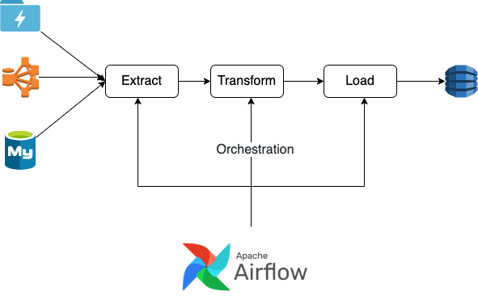

# 什么是Orchestration

Orchestration这个名词其实在海外的项目上用的比较多, 算是属于专有名词吧. 其实很简单, 就是调度器, job, scheduler等等.

我们可以看下图:

Orchestration其实就是一个调度过程, 用来做data pipeline job之间的编排, 其实工作原理就如同Cronjob, 但功能有很多增强, 比如说UI界面, 配置信息, job之间的依赖关系等等.